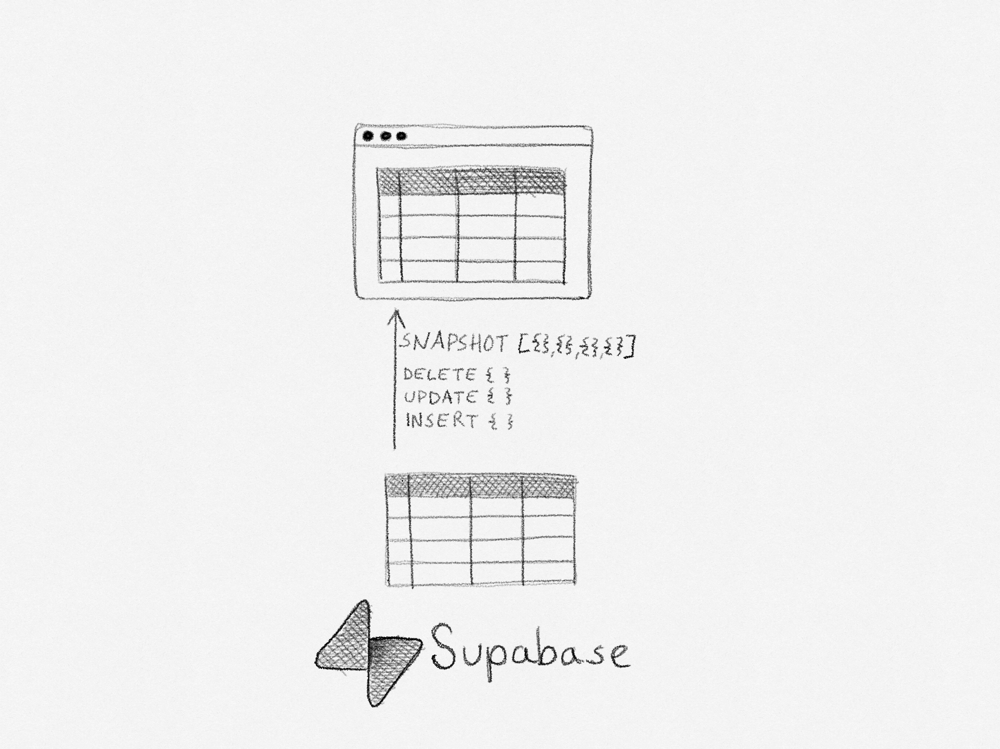

# Supabase Live Table

In-memory replication of a Postgres table, synchronized with [Supabase Realtime](https://supabase.com/docs/guides/realtime).

## Motivation

Some applications need a replica of a table in memory, and keep it up to date with changes to the table in real-time.
Supabase Realtime provides low-level primitives for receiving notifications of changes to a table, but it requires additional complicated logic to keep an exact replica of the table in memory.

Supabase Live Table implements this replication logic.



### In the wild

* [Open Art Market](https://openartmarket.com) uses Supabase Live Table to provide a real-time order book for its art marketplace.
* *Maybe your project? Send us a pull request!*

## Overview

Supabase Live Table provides a `liveTable` function that initializes the table replication.

Supabase Live Table first fetches a snapshot of the table, and then applies incremental updates to the in-memory replica. It handles edge cases of concurrent updates to the table, and guarantees that the in-memory replica stays consistent with the table.

The rows to replicate are filtered by a column value. 

## Installation

    npm install @openartmarket/supabase-live-table

## Usage

The example below shows how to replicate a table called `thing` with a filter column called `type`.

```typescript
import { liveTable } from '@openartmarket/supabase-live-table'
import { SupabaseClient } from '@supabase/supabase-js'
import { Database } from './Database'

type ThingRow = Database['public']['Tables']['thing']['Row']

const channel = liveTable<ThingRow>(supabase, {
  table: 'thing',
  filterColumn: 'type',
  filterValue: 'vehicle',
  callback: (err, things) => {
    if (err) {
      console.error(err);
      return;
    }
    console.log(things);
  }
});
```

Automatic reconnection has been deliberately left out of this library. If the connection is lost, the `callback` function will be called with an error. It's up to the application to handle reconnection. The following example describes how to do this:

```typescript
function subscribe(handleThings: (things: readonly ThingRow[]) => void) {
  const channel = liveTable<ThingRow>(supabase, {
    table: 'thing',
    filterColumn: 'type',
    filterValue: 'vehicle',
    callback: (err, things) => {
      if (err) {
        channel.unsubscribe().then(() => subscribe(handleThings));
        return;
      }
      handleThings(things);
    }
  });
}

subscribe((things) => {
  console.log('Updated things:', things);
});
```

## Table configuration

LiveTable requires a few changes to your database table to work correctly.

### 1. Required columns

The replicated table must have the following columns:

* `id` - a primary key column that maps to a JavaScript `number` or `string` (e.g. `bigint` or `uuid`)
* `created_at` - a timestamp column with a default value of `now()`
* `updated_at` - a timestamp column that is updated automatically when a row is updated (more about this below)
* An arbitrary *filter column* of your choice to filter what rows to replicate. It's strongly recommended to have an index on this column.

In addition to these required columns, you can have any other columns you like.

For example:

```sql
create table "thing" (
  "id" uuid primary key default uuid_generate_v4(),
  "created_at" timestamp with time zone not null default now(),
  "updated_at" timestamp with time zone,
  -- our filter column
  "type" text not null,
  "name" text not null
);

create unique index thing_pkey ON public.thing USING btree (id);
-- Create an index on the filter column
create index thing_type_idx ON public.thing USING btree (type);

```

### 2. Update updated_at automatically

The replication algorithm requires `updated_at` to be updated automatically when a row is updated. This can be done with a trigger:

```sql
create extension if not exists "moddatetime" with schema "extensions";
create trigger handle_updated_at before update on "thing"
  for each row execute procedure moddatetime (updated_at);
```

With this in place, the `updated_at` column will be updated automatically when a row is updated.

### 3. Enable realtime

Make sure the replicated table has `supabase_realtime` publication enabled:

```sql 
drop publication if exists supabase_realtime; 
create publication supabase_realtime; 
-- Specify the table you're enabling realtime for 
alter publication supabase_realtime add table "thing";
```

## Implementation

The [Change Data Capture](https://en.wikipedia.org/wiki/Change_data_capture) algorithm is based on
an algorithm often used in trading systems that subscribe to market data feeds.

Market data feeds typically have two different APIs - one for requesting a snapshot of the current state of the market, and another for receiving incremental updates to the market data in real-time.

In LiveTable, the snapshot is simply a `SELECT` query, and the incremental updates are the Supabase Realtime messages.
The algoritm is as follows:

1. Subscribe to the Supabase Realtime channel for the table.
2. Add incoming Realtime messages to an in-memory FIFO queue.
3. Request a snapshot (`SELECT`) once the Realtime channel is active.
4. Apply snapshot data to the in-memory replica.
5. Process queued Realtime messages that were received while waiting for the snapshot. Skip messages that are older than the snapshot.
6. Update the in-memory replica for every new Realtime message.

### Errors

If the Realtime channel is disconnected as result of a timeout or network error, the `callback` function will be called with an error.

## Testing

There are two test suites for this library:

* [test/liveTable.test.ts](test/liveTable.test.ts) integration test for the `liveTable` function.
* [test/liveTableBuffering.test.ts](test/liveTableBuffering.test.ts) unit tests for concurrency.

It's not possible to reliably test the concurrency of the `liveTable` function, so the unit tests are a best effort attempt to test the concurrency of the buffering algorithm.

The unit tests simulate various concurrency scenarios by interacting directly with the internal `LiveTable` class.
These tests also generate [sequence diagrams](/docs/sequence-diagrams/) that show the order of events for each scenario, as well as the final state of the in-memory replica.

Documenting a system like this is called [living documentation](https://www.amazon.co.uk/Living-Documentation-Cyrille-Martraire/dp/0134689321) and is a great way to keep the documentation up to date.

## License

MIT © [Open Art Market](https://openartmarket.com)
