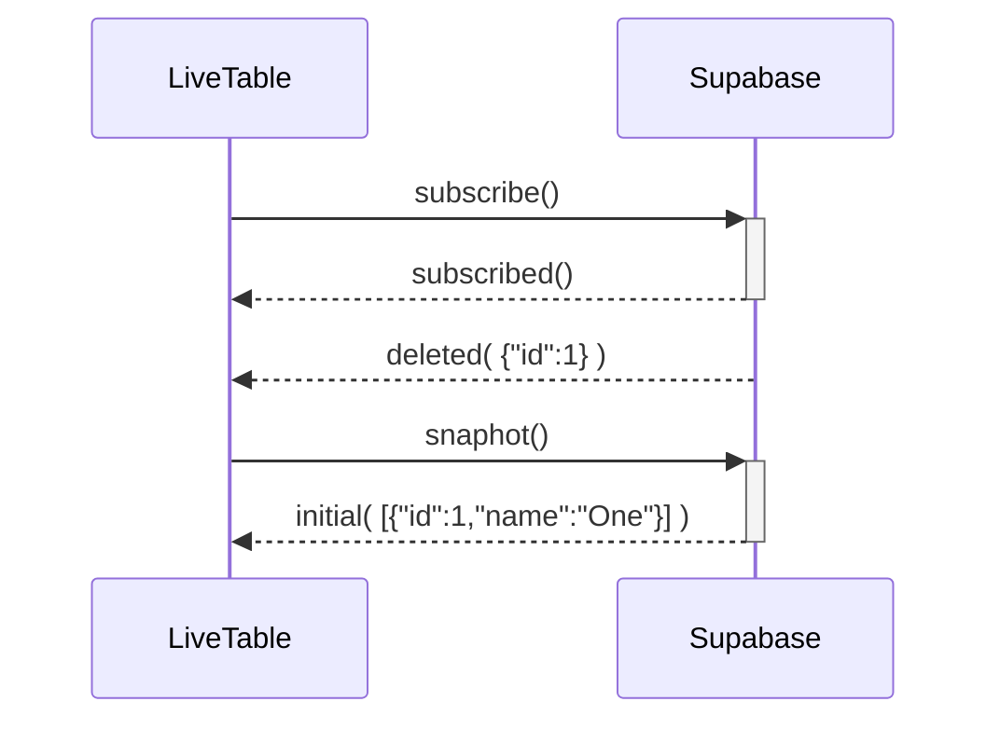

# Supabase Live Table

In-memory replication of a Postgres table, synchronized with [Supabase Realtime](https://supabase.com/docs/guides/realtime).

## Rationale

Supabase Realtime provides low-level primitives for receiving notifications of changes to a table, but it does not provide a way to keep a replica of the table in memory. This library provides a way to do that.

## Overview

Supabase Live Table provides one function (`liveTable`) that replicates a Postgres table in memory, and keeps it up to date with changes to the table in real-time. It uses [Supabase Realtime](https://supabase.com/docs/guides/realtime) to receive notifications of changes to the table, and then updates its in-memory read only replica.

The rows to replicate can be filtered by a column value.

## Installation

### Step 1
```sh
npm install @openartmarket/supabase-live-table
```

### Step 2
Make sure the live data table has supabase_realtime publication
```sql 
drop publication if exists supabase_realtime; 
create publication supabase_realtime; 
-- Specify the table you're enabling realtime for 
alter publication supabase_realtime add table "your_table";
```

## Usage

```typescript
import { liveTable } from '@openartmarket/supabase-live-table'
import { SupabaseClient } from '@supabase/supabase-js'
// From `supabase gen types typescript --local > test/Database.ts`
import { Database } from './Database'

type ThingRow = Database['public']['Tables']['thing']['Row']


// Create a promise that resolves when we've seen the expected records
const p = new Promise<void>((resolve, reject) => {
  // Start a table replication
  const channel = liveTable<ThingRow, 'type'>(supabase, {
    // The table to replicate
    table: 'thing',
    // The column to filter on
    filterColumn: 'type',
    // The value to filter on
    filterValue: 'vehicle',
    // The name of the channel to subscribe to
    channelName: 'thing:vehicle',
    // This callback is called for every change to the table, or if an error occurs
    callback: (err, records) => {
      if (err) return reject(err)
      // Check that we've seen the expected records, which is just one record with name 'bike' and type 'vehicle'
      const actual = records.map(({ type, name }) => ({ type, name })).sort()
      const expected = [{ type: 'vehicle', name: 'bike' }]
      if (JSON.stringify(actual) == JSON.stringify(expected.sort())) {
        channel.unsubscribe().then(() => resolve()).catch(reject)
      }
    }
  })
})
// Insert some records, one of which matches our filter
await supabase.from('thing').insert([
  { type: 'ignored', name: 'skateboard' },
  { type: 'vehicle', name: 'bicycle' },
  { type: 'ignored', name: 'zeppelin' },
]).throwOnError()
// Rename bicycle to bike
await supabase.from('thing').update({ name: 'bike' }).eq('name', 'bicycle').throwOnError()
// Wait until we've seen the expected records
await p

```

## Implementation

The [Change Data Capture](https://en.wikipedia.org/wiki/Change_data_capture) algorithm works as follows:

1. Subscribe to the Supabase Realtime channel for the table.
2. Buffer Incoming Realtime messages in an in-memory queue.
3. Request a snapshot (`SELECT`) once the Realtime channel is active.
4. Apply snapshot data to the in-memory replica.
5. Process queued Realtime messages that were received while waiting for the snapshot.
6. Apply Realtime messages to the in-memory replica.

### Errors
1. The algorithm tries to detect data inconsistency and will throw an error if it detects it.
2. If the Realtime channel is disconnected as result of a timeout or network error. 
3. If we stop receiving heartbeats, an error will be thrown. 

### ⚠️⚠️⚠️ 

Automatic reconnection is out of scope of this library and must be implemented by the caller - typically when the `callback` function is called with an error.

## Examples

The sequence diagrams below show the order of events for the different scenarios, and the final state of the in-memory replica.

### Buffered deletes



Replica:

```json
[]
```

## Testing

There are two test suites for this library:

* [test/liveTable.test.ts](test/liveTable.test.ts) integration test for the `liveTable` function.
* [test/liveTableBuffering.test.ts](test/liveTableBuffering.test.ts) unit tests for concurrency.

It's not possible to reliably test the concurrency of the `liveTable` function, so the unit tests are a best effort attempt to test the concurrency of the buffering algorithm.

The unit tests simulate various concurrency scenarios by interacting directly with the internal `LiveTable` class.
These tests also generate [mermaid sequence diagrams](https://mermaid.js.org/syntax/sequenceDiagram.html) that show the order of events for each scenario, as well as the final state of the in-memory replica.

Documenting a system like this is called [living documentation](https://www.amazon.co.uk/Living-Documentation-Cyrille-Martraire/dp/0134689321) and is a great way to keep the documentation up to date.

## License

MIT © [Open Art Market](https://openartmarket.com)
