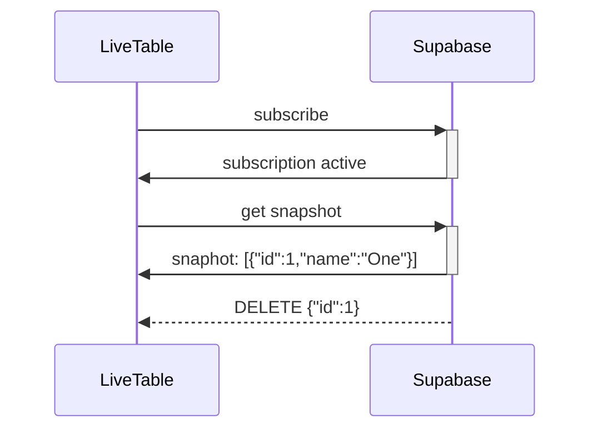

### replays deletes that arrived after the snapshot

```mermaid
sequenceDiagram
  LiveTable->>+Supabase: subscribe
  Supabase->>-LiveTable: subscription active
  LiveTable->>+Supabase: get snapshot
  Supabase->>-LiveTable: snaphot: [{"id":1,"name":"One"}]
  Supabase-->>LiveTable: DELETE {"id":1}
```

```json
[]
```
