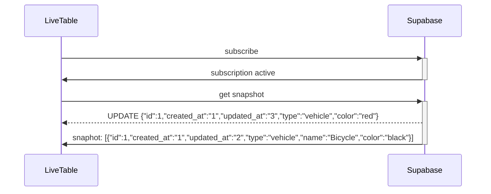

### merges updates with previous value



### replica
```json
[
  {
    "id": 1,
    "created_at": "1",
    "updated_at": "3",
    "type": "vehicle",
    "name": "Bicycle",
    "color": "red"
  }
]
```
