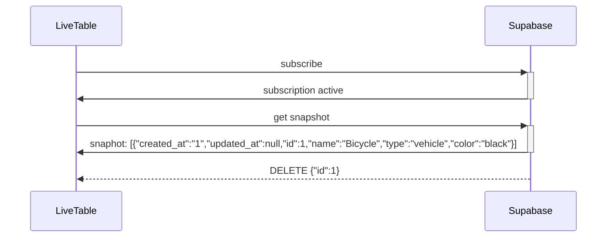

### replays deletes that arrived after the snapshot


```mermaid
sequenceDiagram
  LiveTable->>+Supabase: subscribe
  Supabase->>-LiveTable: subscription active
  LiveTable->>+Supabase: get snapshot
  Supabase->>-LiveTable: snaphot: [{"created_at":"1","updated_at":null,"id":1,"name":"Bicycle","type":"vehicle","color":"black"}]
  Supabase-->>LiveTable: DELETE {"id":1}
```

### replica
```json
[]
```
