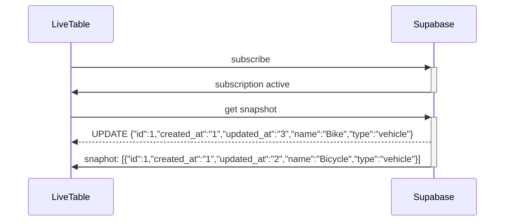

### replays updates that are more recent than snapshot and arrived before



### replica
```json
[
  {
    "id": 1,
    "created_at": "1",
    "updated_at": "3",
    "name": "Bike",
    "type": "vehicle"
  }
]
```
