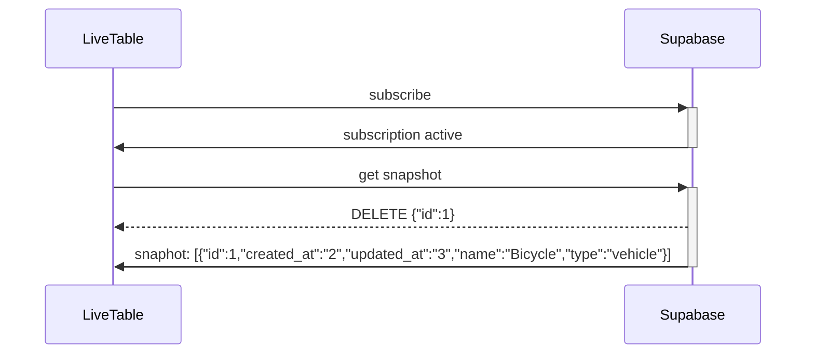

### skips deletes that predate the snapshot


```mermaid
sequenceDiagram
  LiveTable->>+Supabase: subscribe
  Supabase->>-LiveTable: subscription active
  LiveTable->>+Supabase: get snapshot
  Supabase-->>LiveTable: DELETE {"id":1}
  Supabase->>-LiveTable: snaphot: [{"id":1,"created_at":"2","updated_at":"3","name":"Bicycle","type":"vehicle"}]
```

### replica
```json
[
  {
    "id": 1,
    "created_at": "2",
    "updated_at": "3",
    "name": "Bicycle",
    "type": "vehicle"
  }
]
```
