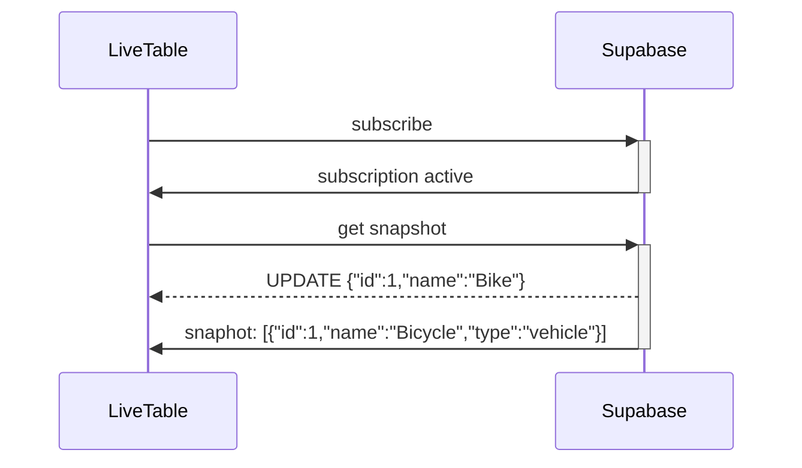

### skips events that predate the snapshot

```mermaid
sequenceDiagram
  LiveTable->>+Supabase: subscribe
  Supabase->>-LiveTable: subscription active
  LiveTable->>+Supabase: get snapshot
  Supabase-->>LiveTable: UPDATE {"id":1,"name":"Bike"}
  Supabase->>-LiveTable: snaphot: [{"id":1,"name":"Bicycle","type":"vehicle"}]
```

```json
[
  {
    "id": 1,
    "name": "Bicycle",
    "type": "vehicle"
  }
]
```
