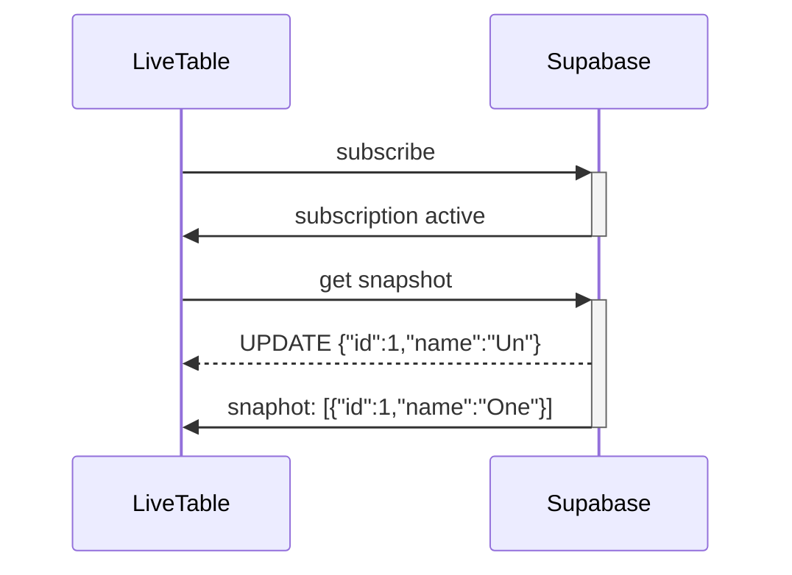

### skips events that predate the snapshot

```mermaid
sequenceDiagram
  LiveTable->>+Supabase: subscribe
  Supabase->>-LiveTable: subscription active
  LiveTable->>+Supabase: get snapshot
  Supabase-->>LiveTable: UPDATE {"id":1,"name":"Un"}
  Supabase->>-LiveTable: snaphot: [{"id":1,"name":"One"}]
```

```json
[
  {
    "id": 1,
    "created_at": "2023-09-21T22:28:00.01Z",
    "updated_at": "2023-09-21T22:28:00.02Z",
    "name": "One"
  }
]
```
